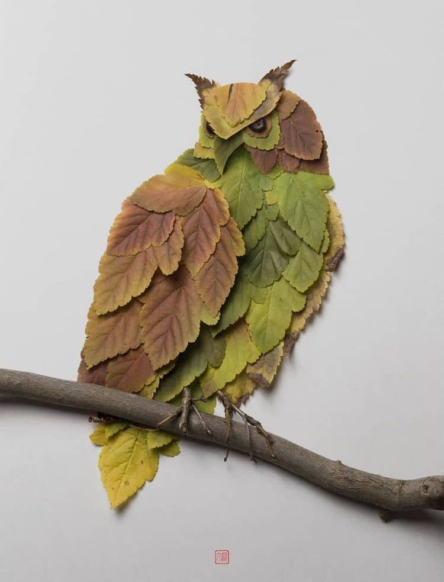
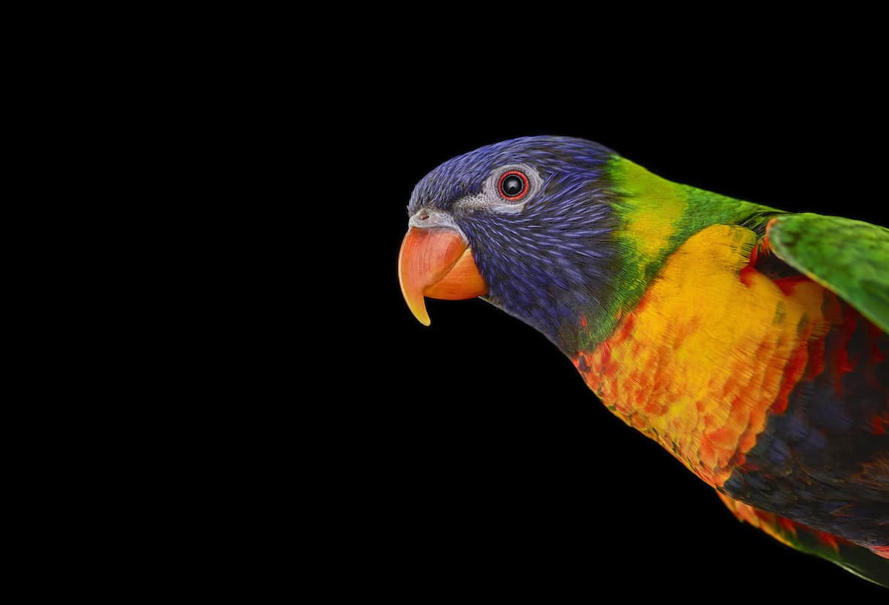
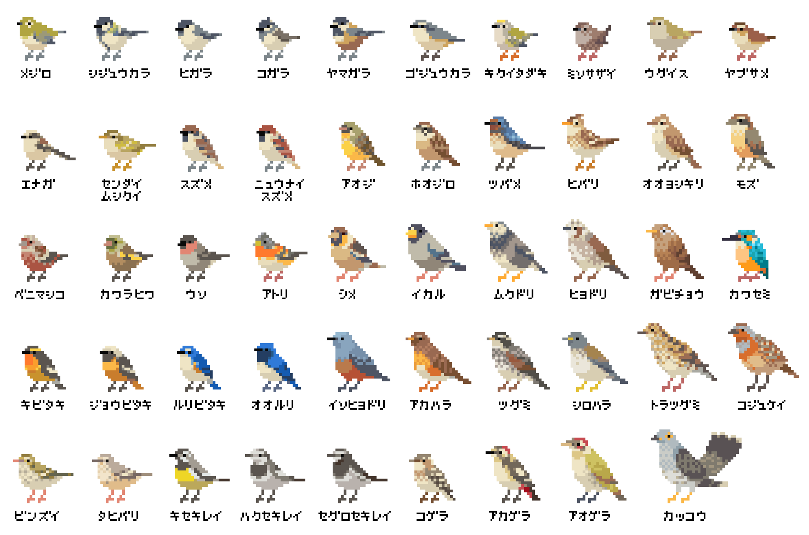

#+title: 收藏夹
#+date: <2021-05-19 Wed 08:10>
#+author: thebesttv

这里大概会放一些我喜欢的东西🥰

* 妙妙文章

- [[https://idealclover.top/archives/627/][2020 年年终总结：致即将 22 岁的自己 --- 翠翠]] 你工人爷爷的年终总结
- [[https://qinyuanpei.github.io/posts/2136925853/][假如时间有温度 --- 飞鸿踏雪]] 活着真好
- [[https://joelcalifa.com/blog/tiny-wins/][Tiny Wins --- The big benefits of little changes.]] 胜利在小处
- [[https://www.zhihu.com/question/63306763/answer/255496822][为什么计算机科学如密码学喜欢用 Alice 和 Bob 举栗子？ --- 刘巍然-学酥的回答]]
- [[https://www.zhihu.com/question/487165905][如何看待媒体曝光北京医院周边「黑民宿」两居室住 12 人？「黑民宿」问题应该如何解决？]]
  #+begin_quote
  钱，只有死了，才是身外之物，只要没死，钱就是命。——[[https://www.zhihu.com/question/487165905/answer/2134810284][邢二狗]]
  #+end_quote
  #+begin_quote
  我们写东西是给老百姓看的，底层人民就算做错了什么，也不值得我们去指责。
  更不要去催动什么力量去破坏老百姓赖以生存的东西。

  我看见有的人住着几十元一天的大通铺，结算几千元一天的医药费。——[[https://www.zhihu.com/question/487165905/answer/2136855559][刘凯]]
  #+end_quote
- [[https://www.zhihu.com/question/471105298/answer/1995471916][如何看待2022年秋招Java后端开发岗一片红海？ --- 圆角骑士魔理沙的回答]]
  #+begin_quote
  然后，乖乖的有整个cs的一个体系的学习。arch \to os \to compiler \to
  database + (network \to distributed system)。Basic Programming +
  Algorithm + Discrete Math + Linear Algebra + PL + SE。去看顶级大学
  （如四大）的公开课。大学设计这些为重要课程不是在逗你玩的，就是因为这
  些东东进可攻，让你做 X for Y 方向，退可守，一个方向没岗位还能做其他
  的。这是海量教授精确计算出来的，比我懂更比你懂。
  #+end_quote
- [[https://www.zhihu.com/question/39596383/answer/82267124][Java标准为什么不加入unsigned int类型?]]
  #+begin_quote
  那些个时髦语言不过是暂时裸体而已，等把程序员勾引到手了，最后会把脱掉的衣服一件件穿回去
  #+end_quote
- [[https://blog.cyyself.name/first-3-years-undergraduate/][大学前三年的流水账 --- CYY]]
- [[http://tenfourfox.blogspot.com/2020/04/the-end-of-tenfourfox-and-what-ive.html][The end of TenFourFox and what I've learned from it]]
  #+begin_quote
  For better or for worse, web browsers' primary role is no longer to
  view documents; it is to view *applications that, by sheer
  coincidence, sometimes resemble documents*.

  What should you do?  Phrase it better.  Post your reports with the
  attitude that you are just one user, using free software, from the
  humility of your own personal experience on your own system.  Make
  it clear you don't expect anything from the report, you are grateful
  the software exists, you intend to keep using it and this is your
  small way of giving back.  Say this in words because I can't see
  your face or hear your voice.  Write "thank you" and mean it.
  Acknowledge the costs in time and money to bring it to you.  Tell me
  what's good about it and what you use it for.  That's how you create
  a relationship where *I can see you as a person and not a demand
  request*, and where *you can see me as a maintainer and not a
  vending machine*.  Value my work so that I can value your insights
  into it.  Politeness, courtesy and understanding didn't go out the
  window just because we're interacting through a computer screen.
  #+end_quote
- [[https://www.zhihu.com/question/356443075/answer/927761559][大学老师上课时没人听是什么感觉？ --- 邸敬棋的回答]] 好可爱的老师

  还有个很可爱的回复:
  #+begin_quote
  我抬头是QAQ? \\
  老师通常会是OwO! \\
  然后我继续QAQ? \\
  然后老师继续OAO! \\
  然后我就QwQ了 ——[[https://www.zhihu.com/people/zhang-rui-zhe-20][Dueta张]]
  #+end_quote
- [[https://www.nextplatform.com/2021/07/12/gutting-decades-of-architecture-to-build-a-new-kind-of-processor/][Gutting Decades Of Architecture To Build A New Kind Of Processor]] 神
  奇的 [[https://en.wikipedia.org/wiki/No_instruction_set_computing][NISC]]
- [[https://www.zhihu.com/question/499597731/answer/2228661271][如何看待 CVPR2022 截稿时间因为微软服务器崩溃延长 36 小时？ ---
  Yulong的回答]] 😂
  #+begin_quote
  paper第一定律： \\
  paper可以凭空产生，但不会消失 \\
  只会从一种格式换成另外一种格式 \\
  或是从一个会议转投另外一个会议 \\
  在此过程中，paper总量遵循摩尔定律 \\
  即每18个月总投稿量翻一倍 \\
  因此，应该是服务器没扩容
  #+end_quote
- [[https://0xffff.one/d/358-ji-suan-ji-ru-men-zhuan-ti-step-1-xin-tai-pian][计算机入门 Step 1 心态篇 --- 0x0001]] 一些关于大学, 关于CS的总结
- [[https://web.archive.org/web/20210629030926/https://www.163.com/dy/article/GDBA12M70536O239.html][中国未来最大的挑战 --- 饶毅]]
  #+begin_quote
  我们中华民族缺乏科学传统，科学在中国的发展历史短暂，加上实用主义的文
  化，我们如何扭转科技人才质量下滑、人数减少，激励一定数量的高质量的人
  才加入科学技术，正面影响中国的未来，是很大的挑战。
  #+end_quote
- [[https://www.zhihu.com/question/23577025/answer/132373616][什么时候会觉得自己需要一个女朋友? --- 画狮秋石的回答]]
  #+begin_quote
  有一天我吃完泡面发现洗洁精用光了，我随手用剃须膏洗碗时，会觉得可能要
  是有一个女朋友就好了。

  并不是因为有个女朋友就可以不吃泡面，也不是因为有个女朋友就有人会帮忙
  洗碗，是我想在洗完碗转身回去时会有个人在那里，等着我一脸神秘的说

  “嘿！你猜我刚刚用什么洗的碗”？
  #+end_quote
  还有下面的一个评论:
  #+begin_quote
  生活里发生了好多有趣的事情，在路上拍了好多照片，就是希望跟某个人分享。
  后来有趣的事情不断被琐事淹没，照片卡爆了内存被删掉，我从未找到那个人。

  ——[[https://www.zhihu.com/people/li-ying-jiu-62][SS109]]
  #+end_quote
- [[https://phabricator.wikimedia.org/T273741][Investigate unusual media traffic pattern for AsterNovi-belgii-flower-1mb.jpg on Commons]]
  #+begin_quote
  维基百科发现，每天有来自印度不同 ISP 的9000万个请求，都在读取一张花
  朵的照片，占到网站总流量的20%。这些请求都是真实的，不像是 DDoS 攻击，
  但是 HTTP 请求的头信息没有提供任何线索。

  这是官方的调查过程，讲述如何从有限的信息里面，推测出到底这是怎么一回
  事。

  ——科技爱好者周刊（第 147 期）
  #+end_quote
- [[https://telegra.ph/Consume-Less-Create-More-Its-More-Fun-12-04][Consume Less. Create More. It’s More Fun.]]
- [[https://www.nytimes.com/2022/02/07/technology/computer-chips-errors.html][Tiny Chips, Big Headaches]] 不可靠的硬件增加了😮‍💨
  #+begin_quote
  He likens the chip to an apartment building that would span the
  surface of the entire United States.  [...] finding new errors was a
  little like searching for a single running faucet, in one apartment
  in that building, that malfunctions only when a bedroom light is on
  and the apartment door is open.
  #+end_quote
- [[https://www.zhihu.com/question/515466392/answer/2340804444][谷爱凌在谈到国籍问题时回应：「中国和美国我都想感谢，体育让我们团结在一起」，如何看待她对此的态度？ - Michael Jackson的回答]]
  #+begin_quote
  作为中国普通人民的一员，我羡慕谷爱凌的高度，甚至说是高山仰止，也清醒客观地认识到跨国精英阶层的强大，向他们学习。

  但我更加关怀全红婵，因为她和我们一样，都是没有资本支撑，和美国名校、极限运动没什么交集，全靠双手去内卷拼搏未来的人。

  我很关心我们普通人通过努力，是否能有一个很美好的未来。
  #+end_quote
- [[https://www.zhihu.com/question/512485525/answer/2322652933][数据显示，近五成老人找不到想看的电视节目，为什么「智能电视」的操作设计得这么复杂？ - 我要珍惜账号的回答 - 知乎]]
  #+begin_quote
  投放广告，才是我国互联网产业的终极目标.
  #+end_quote
- [[https://www.zhihu.com/question/513683468/answer/2330252821][吃鱼卡到刺，父母让我喝醋大口吞咽饭，我跟他们说没用因此被骂，是我的错吗？ - 心存星光的回答 - 知乎]]
- [[https://www.quora.com/What-do-you-know-that-most-people-don%E2%80%99t/answer/Amit-Pant-53][What do you know that most people don’t? - Amit Pant's answer - Quora]]
- [[https://www.zhihu.com/question/40712955/answer/87890964][如何向外行解释产品经理频繁更改需求为什么会令程序员烦恼? - 萤火一号的回答 - 知乎]]
- [[https://www.zhihu.com/question/520058625/answer/2380144431][为什么安225一没，都出来惋惜了? - 痛风三世的回答 - 知乎]]
  #+begin_quote
  现在是2022年，如果1967年的人们来到今天，我们该怎么跟他们解释这个世界呢？

  “我们刚刚失去了世界上最大的飞机，人类上一次登上月球已经是五十年前的事情了，对对，我们现在的电脑算力是你无法想象的程度，哦，我们用它来制作梗图和运算给用户推送什么样的短视频。还有，带好口罩，绝大多数国家现在面对全球大疫情的办法还是用人命去降低病毒的致死率。”
  #+end_quote
- [[https://www.zhihu.com/question/519533257/answer/2382970548][如何看待基辅撤侨中某女留学生的巨婴行为? - 安好心的回答 - 知乎]]
- [[https://www.theguardian.com/lifeandstyle/2021/dec/17/bob-innes-rent-a-hitman-assassin-services-website][Meet the man who accidentally started an assassin hiring website]]
  An assassin hiring website that saves lives.
- [[https://martinfowler.com/bliki/TwoHardThings.html][TwoHardThings]]
  #+begin_quote
  There are only two hard things in Computer Science: cache invalidation and naming things.
  ---Phil Karlton

  There are 2 hard problems in computer science: cache invalidation, naming things, and off-by-1 errors.
  ---Leon Bambrick

  There are only two hard problems in distributed systems:  2. Exactly-once delivery 1. Guaranteed order of messages 2. Exactly-once delivery
  ---Mathias Verraes
  #+end_quote
- [[https://www.zhihu.com/question/53975947/answer/240259923][说一说你听过的最冷门的诗？ - 智慧的屏障的回答 - 知乎]]
  #+begin_verse
  咏史（李梦唐）
  高阁垂裳调鼎时，可怜天下有微词。
  覆舟水是苍生泪，不到横流君不知。
  #+end_verse
- [[https://www.zhihu.com/question/407589496/answer/2401818740][为什么每年315曝光的问题都不提前公布？这不是让消费者继续买单？ - 申权认真生活的回答 - 知乎]]
  #+begin_quote
  管理现场有专门的人，现场的问题看似是工人的问题，本质上是负责管理的人的问题。我直接去制止工人，看似解决了问题，但不能对负责管理的人形成震慑，这种问题注定还会不断的复发。但如果我直接去找负责管理的人，我的权力是不够的。到时候非但不能对他形成震慑，反而可能陷自己于危险的境地。所以我认为要真正的解决问题，一定要找到大的影响力平台，在高层面前当众提出问题，这样才能对负责管理的人形成足够的震慑，才有可能从根源上解决问题。
  #+end_quote
- [[https://www.zhihu.com/question/23181860/answer/2401290410][南京珠江路地铁站为什么叫糖果站？ - 厨房人类的回答 - 知乎]] 🍬🍬
- [[https://www.cbc.ca/radio/quirks/oct-23-vikings-in-newfoundland-new-rocks-from-the-moon-making-wood-better-and-more-1.6219865/scientists-have-found-a-way-to-harden-wood-to-make-a-knife-that-rivals-steel-1.6219874][Scientists have found a way to harden wood to make a knife that rivals steel]]
  Hard wood
- [[https://knowablemagazine.org/article/health-disease/2021/how-noise-pollution-affects-heart-health][Sounding the alarm: How noise hurts the heart]] 你的sb舍友会导致你短命
- [[https://0xffff.one/d/1027-yi-ge-ji-shu-nan-de-zi-bai][一个技术男的自白]] 深度或广度? 还有一些其他的
- [[https://mp.weixin.qq.com/s/zvExUwCiiBKnBjRXAbOMvA][我在方舱，看见老人们的孤岛求生]], [[https://hayami.typlog.io/camp][博客]] 不能白白死去。
  #+begin_quote
  意志消沉并不是一种抵抗的方式，好好生活其实就是一种最大的抵抗。

  记录下所看到的听到的感受到的一切，记住现在的痛苦愤怒和心碎，并提醒人们不要忘记。
  #+end_quote
- [[https://httpie.io/blog/stardust][How we lost 54k GitHub stars]]
  #+begin_quote
  When the user is about to destroy something, don’t describe that as a
  potential scenario in abstract words that the user needs to convert to mental
  images and put values on.
  #+end_quote
- [[https://www.zhihu.com/question/394331280/answer/2442971918][为什么现在越来越多的国产剧不接地气了？ - 小球藻追梦人的回答 - 知乎]]
  怀念那个球进了的时代.
- [[https://www.zhihu.com/question/67013987/answer/730478844][你们的老师做过什么惊为天人的事情？ - 剑圣的跳刀的回答 - 知乎]]
- [[https://www.zhihu.com/question/40599605][为什么「兔子」叫「兔几」，「橙子」却叫「橙砸」？]] 哈哈哈好欢乐的问题
- [[https://qualityfocus.club/fun-debug][一次集文化差异、网络工程与诸多巧合于一身的debug！]] 一个由泡茶引发的断网
- [[https://ugmonk.com/blogs/journal/analog-the-simplest-productivity-system][Analog: The Simplest Productivity System]] Somethings are better ANALOG.
- [[https://www.ifanr.com/app/1448161][再也不用「挤牙膏」！高露洁换上的「润滑剂」包装，让牙膏从此一滴不剩]]
  Building a Frictionless Future
- [[https://spectrum.ieee.org/plastic-microprocessor][The First High-Yield, Sub-Penny Plastic Processor]]
  "Plastic inside"
- Hacker News 上的[[https://news.ycombinator.com/item?id=30157986][一个评论]], 能有专门来刺探面试题目的人是没想到的
  #+begin_quote
  I once interviewed a person who couldn't answer a single question, not
  even the easiest ones.  He would just say "I don't know, ask me the
  next question".  A few weeks later I realized it was probably a plant
  that another candidate sent to collect the interview questions.  And I
  think I even know who it was.  We hired her, she wasn't very good
  writing code.  But she answered all our questions perfectly, which
  only happened once before.
  #+end_quote
- [[https://finance.sina.com.cn/money/bank/gsdt/2022-07-06/doc-imizmscv0377623.shtml][储户近200万巨款不翼而飞 人脸识别漏洞成骗子作案工具]]
  有点可怕了, 感觉随着个人信息的分散式泄漏, 将来的问题会越来越多.
- [[https://www.webbcompare.com/][WebbCompare]] 哈勃和韦伯望远镜拍摄照片的对比, 韦伯拍的真的好惊艳~
- [[https://zhuanlan.zhihu.com/p/542488093][“Only One Book”计划（计算机理论）]] 每个领域只推一本书, 防止选择困难症~
- [[https://threadreaderapp.com/thread/1449858706750033921.html][I once killed a $125 million deal by being “too honest.”]]
  #+begin_quote
  a deal isn't done until it's closed.  No matter how much you want to
  be on the same side of the table as the other party, don't show your
  cards until the game is over.
  #+end_quote
- [[https://www.zhihu.com/question/462506633/answer/2501299333][如果生三胎，国家赠送一套房子，你会生吗？ - 岳照眠的回答 - 知乎]]
  #+begin_quote
  不会，因为很明显孩子生下来才给我房子，如果我生了孩子国家不给我房子，我一点办法都没有。

  到时候孩子生了，房子没有。我能把孩子塞肚子里吗？很明显不能。

  我没有后悔的余地，国家有。
  #+end_quote
- [[https://mymodernmet.com/raku-inoue-plant-arrangements/][Artist Forages Fallen Flora and Arranges It Into Exquisite Portraits of Animals and Insects]]
  有好看的鸟鸟~
  {{{image(60)}}}
  
- [[https://www.zhihu.com/question/291597382/answer/2658464738][为什么越来越多博士逃离科研？ - 阿昆的科研日常的回答 - 知乎]]
  什么是真正重要的?
  #+begin_quote
  以前我可能没得选，但现在，我要把自己有限的时间留给那些值得的人和事。
  #+end_quote
- [[https://dys2p.com/en/2021-12-tamper-evident-protection.html][Random Mosaic – Detecting unauthorized physical access with beans, lentils and colored rice]]
  简单廉价的手段来确保货物没被拆封过
- [[https://www.zhihu.com/question/450856912/answer/2378730522][中国一旦攻克芯片难题，芯片会变成白菜价吗？ - 实在哥的回答 - 知乎]]
  #+begin_quote
  中国早就攻克了住房建造的难题。

  请问房地产变白菜价了吗?
  #+end_quote
- [[https://mp.weixin.qq.com/s/q461so9lWk4FKJGZ-p7Vcg][提问的智慧-中国版]] 相比原版做了些本土化, 而且简短了不少🤠
- [[https://github.com/readme/guides/publishing-your-work][Publishing your work increases your luck]] 不要害怕分享
  #+begin_quote
  Whatever you’re excited about, be excited about it publicly.
  Whatever you’re curious about, be curious about it publicly.
  #+end_quote
- [[https://www.zhihu.com/question/312017458/answer/649571239][要不要给导师送特产？ - 知乎]] 哈哈哈哈🐓打鸣
- Modern Family S01E07 --- The ABC's of salesmanship
  #+begin_quote
  Always Be Closing.  Don't Ever Forget Great Home Ideas.  Just Keep
  Lurking, Mostly Nearby.  Often People Question Realtors' Sincerity.
  Take Umbrage.  Violators Will ...
  #+end_quote
- [[https://mymodernmet.com/brad-wilson-other-world-animal-portraits/][Photographer Captures Striking Studio Portraits To Show a Dignified Side of Wild Animals]]
  帅气好看的鸟鸟😍
  # zero width space is appended to the end of each image for separation
  {{{image(80)}}}
  ​
  {{{image(80)}}}
  ​
- [[https://news.cctv.com/2022/07/26/ARTI8BSaRrZN0hW2SN7BnNjs220726.shtml][年轻一代助浴师“出师” 为老人守住尊严]]
  面对人口老龄化, 希望老人护理相关的职业更多一些
- [[https://velvetshark.com/articles/why-do-brands-change-their-logos-and-look-like-everyone-else][Why do so many brands change their logos and look like everyone else?]]
  Sans serif invasion
  #+begin_quote
  Shoot for simplicity and legibility, but keep your distinguishing features.
  #+end_quote
- [[https://www.reddit.com/r/space/comments/arer0k/i_took_nearly_50000_images_of_the_night_sky_to/][I took nearly 50,000 images of the night sky to make an 81 Megapixel image of Tuesday's moon.]]
  超清月球写真
- [[https://www.kdocs.cn/l/cneDzlnQ6BPE][迷你充电头发展史]]
  1. [[https://www.coolapk.com/feed/42741337][从大砖头到小方块]]
  2. [[https://www.coolapk.com/feed/42814287][“世界最小充电器”和“口红”们]]
- [[https://simonwillison.net/2022/Nov/6/what-to-blog-about/][What to blog about]] blog about what you learnt and what you built
- [[https://www.zhihu.com/question/267235686/answer/2894482031][男老师会对女学生有想法嘛？ - 知乎]] 男政治老师追女音乐老师(连载中);
  不愧是政治老师, 说话就是不一样; 评论附保姆级脱单教学hhh
  #+begin_details
  @@html:
保姆级脱单教学
@@
  第一步，找个理由打个照面沟通些不大不小的事，顺便就把微信加了。主要是看看独处时对方气场，礼貌，脾气大概怎样。千万别去主动闲聊。

  第二步，隔个三五天偶遇一下，同个单位上班，再不济吃饭总碰得到对吧。碰到就简单点喊一声某老师招个手完事，自己不要多聊，除非对方心情好主动跟你聊。

  第三步，偶遇半个月多点，可以根据对方朋友圈你感兴趣的内容发起对话，别去评论，私聊，时间就放在晚饭后。主要就是看下对方回复速度，语气，态度。别发问，每一句话都是陈述句，分享心情表看法观点，别问任何事，除非是那种不得不问，不问才怪的情况。发起对话时间也是三五天一次，对方热络的话加频。

  第四步，聊个半个月左右吧也是，差不多就能知道对方是否单身，晚饭后一般在哪做些啥，跟你聊天是礼貌性敷衍下的还是开心的了。这些都不用问的，自己琢磨下就有数了。

  第五步，也就是最后一步，根据前四步判断是否单约晚饭电影。你有经验或者比较敏锐的话根据对方的态度就已经会感觉到有没有对你有好感了。没什么感觉的话直接约，发个某地美食照片，配一句，一起去尝尝不，听说挺不错的。如果对面回当天有事，马上换个日期问她。到时候能单约出来就没啥好担心的了，吃完直接约电影。约不出来就不用再有什么私交了，除非对方以后主动约你。

  玩得开心就每周末都约一约，还是老规矩，日期可以为她改一次，约不出来就不用再私下多说什么废话，除非工作，我想你政治跟她音乐也没什么工作好交接。

  能约出来就不用，也不能再隔三差五发消息聊天了。憋着。约前一天闲聊摸对方心情和时间安排，约的当晚聊聊在一起发生的事，一句晚安不用更多别的，如果一周约一次，那么一周主动发起聊两次。对方发起找你聊可接话，依然不问任何问题。

  多换换地方玩，一个月或者三五次以后不经意碰碰手，肩，什么都不用说，看看对方脸，眼神，气氛。以后每约一次肢体接触升级，直到拉起手。被轻轻挣脱可以再试一次，还不行就算了。拉起手以后不用多说了吧…

  反复尝试单约和拉手，对方如果找闺蜜赴约的话大方点请个客，吃饭聊聊天，吃完后之后早点找个事溜，没必要浪费时间。事后说声抱歉再单约她。整个流程下来，无论是约不动，还是可以约的出来但是牵不上手，都可以再试一次，但事不到三，两次足以。微信聊天阶段回复慢或者不回复都可以洗洗睡了，不用浪费时间。

  你说的阶级很难突破是事实，人家年纪大眼光高条件好是事实，可能很多优秀的人追是事实…但，跟这个女人人品性格以及你两交朋友关系不大。别还不熟就已经想到婚姻生活了，别太抽象…人是感情动物，是社会动物，都有社交需求的，说不定人家接触了就喜欢你呢？中间难以升级到拉手也没什么丢人的，这事你知她知再无人知，你也没说什么让彼此难堪的话，微信也没留什么尴尬的话，她也不好跟别人乱说。

  保姆级教学，按图索骥即可，希望对你有帮助。切记，能聊别问，能约少聊，能约多碰，无表白环节。拉手成功请一个牛肉汉堡，之后随你怎么表白。

  ---​[[https://www.zhihu.com/people/15-61-61-40][你不对劲]]
  #+end_details
- [[https://www.zhihu.com/question/434879153/answer/1629086329][同学考试作弊，我举报了他，导致他被处分丢了学位证，现在我好像被全班孤立了，我有错吗？ - 知乎]]
  当个“人”挺好
- [[https://www.zhihu.com/question/496689201/answer/2257222872][能力不如我的同学，秋招拿到了60w+的offer，心里非常难受是怎么回事？ - 高国彬的回答 - 知乎]]
  555好真实
  #+begin_quote
  科研只为把业毕 \\
  成绩挂科不在意 \\
  导师项目导师急 \\
  自己事情靠自己
  #+end_quote
- [[https://www.zhihu.com/question/38608967/answer/77622027][医学实习生操作时误把患者留置针拔掉了，心理阴影很大，怎么办? - 知乎]]
  “经过这一次，你永远都不会再犯这种错误。”
- [[https://www.zhihu.com/question/620622224/answer/3201889486][如何用“你”“值得”“被爱”造句？ - 安清的回答 - 知乎]]
  #+begin_quote
  “你知道么，因为各种数值得当，炭丝被爱迪生用做灯丝。”
  #+end_quote
- [[https://www.zhihu.com/question/57252202/answer/3156620020][如何反驳：「简体『爱』相对繁体『愛』少了『心』，所以大陆人的爱没有心」？ - Patriot的回答 - 知乎]]
  #+begin_quote
  汉字简化后，党内无黑，团中有才，国含宝玉，爱因友存，美还是美，善还是善，虽丑无鬼，只不过台无吉，湾无言。穷不躬，权不佳，车不行田，坚不称臣。无鹿亦能丽，无巫亦能灵，无水亦能灭，无火亦能劳，无曲亦能礼，无手亦能击。办事左右不辛苦，垦荒何必靠豺狼

  繁体：\\
  漢字簡化後，黨內無黑，團中有才，國含寶玉，愛因友存，美還是美，善還是善，雖醜無鬼，只不過臺無吉，灣無言。 窮不躬，權不佳，車不行田，堅不稱臣。 無鹿亦能麗，無巫亦能靈，無水亦能滅，無火亦能勞，無曲亦能禮，無手亦能擊。 辦事左右不辛苦，墾荒何必靠豺狼
  #+end_quote
- [[https://www.zhihu.com/question/614576443/answer/3274505280][如果让你超级有钱，代价是永远没有人喜欢自己(爱情的那种)，你愿意吗？ - 萝卜的回答 - 知乎]]
  #+begin_details
  如果我超级有钱，我可以把所有烂尾房全部买下来，接手建设成新的，可以住人的房子。让居者有其屋。

  我可以：
  1. 在西部投资建立大量风力、太阳能发电厂并网，在河南等地建立大量立体化种植农场，提供大量就业机会，
  2. 设立大批实验性种子农场，提升粮食作物产量及抗病性
  3. 保障中国粮食安全，打压一下全球粮价，让10-20亿第三世界国家人口能免于饥饿
  4. 设立10-20个实验室，用国家预算级别的资金去冲击基础材料科学，补齐材料学短板
  5. 完善全国公路交通体系，建立一市一机场、一市一高铁、一县一高速的飞机、高铁、公路网体系；
  6. 普及12年制义务教育，并提高高等教育人员比例，投身于机械、人工智能开发、信息网络开发等领域
  7. 完善全国医保体系，建立大重病全免的医疗保障制度，哪怕一个穷人也能看得起病，吃到最好的靶向药
  8. 建立医药实验室，攻克癌症、艾滋等绝症，并试着完全治愈对肝炎、糖尿病等慢性疾病
  9. 建立保障房制度及高速通勤体系
  10. 更好的生育、养老、失业保障体系
  可控核聚变、开发太空、月球电梯……

  有了超级多的钱以后，老子真的有太多事情想去做 \\
  儿时仰望星空，有太多太多异想天开的想法 \\
  此刻，我终于有能力把梦想实现，而需要付出的代价却微乎其微 \\
  太多太多的事要做，人的寿命和能做的事实在太短、太少 \\

  各位亲爱的达瓦里希， \\
  当温暖的阳光洒在地上，你和你相爱的人牵手穿过和熙的春风 \\
  当傍晚的夕阳洒下，你的家里飘出红烧肉的香气，一家人围坐在餐桌前，享受着美味的晚餐， \\
  当夏夜，你们一家人在外纳凉，带着小孩走进树林，手电的光在树丛中摇曳 \\
  请诸位亲爱的兄弟姐妹，替我去歌颂爱情，燃烧青春，去建立家庭，去陪伴子女成长，去拥抱美丽的未来 \\

  而我，将替诸位去建设新的世界 \\
  没有战争、疾病、饥荒与贫穷的世界 \\
  人与人不需要通过掠夺就能过上幸福生活的世界 \\
  没有彻夜加班，没有高企的房价，不需要竭尽全力去求生，也能快乐生活的富足世界 \\

  只要能够实现这个伟大的世界，不，甚至只要能打开一扇通往这世界的大门 \\
  区区“没有人爱我，我好可怜”， \\
  这实在算不上是代价。 \\
  #+end_details
- [[https://mp.weixin.qq.com/s/bOnW8gDJ-dXp4KbAjhDw9A][左耳朵耗子的话]]
  陈皓关于创业、技术、成长的思考

** 关于死亡 --- 让世界知道我来过

- [[https://www.zhihu.com/question/506002000/answer/2271193155][毛星云意外身故，如何评价他在游戏开发圈的影响力？ --- 怪力乱神的回答]]
  对回答下面的一个评论比较有感触:
  #+begin_quote
  没必要生气，把你摆在那个认知水平下，你也只会得出类似的结论。

  从吃着人血馒头，对一切苦难和不公都麻木不仁的晚清群众，到为了革命抛头
  颅洒热血的近代人民，靠的是教育，无论是书本上的知识教育，还是现实生活
  中的经历教育，都能让人蜕变。

  在大多数群众认知水平普遍低下的时候，国家和社会倾尽全力养育出一批知识
  分子，不是让你们学成之后回过头来对着群众破口大骂的，而是让你们想办法
  去扭转、改变这一局面，让大多数人都能变得更智慧、更文明的。

  ——[[https://www.zhihu.com/people/tang-huan-tao-81][金闪闪尼古尼古​]]
  #+end_quote
- [[https://www.zhihu.com/question/505481994/answer/2381645820][为什么明明是葬礼，可是在吃席的时候，人们还是有说有笑？ - 卢啸天的回答 - 知乎]]
  #+begin_quote
  为了让大家知道，这个家还没有散。

  生活还会继续～
  #+end_quote
- [[https://mp.weixin.qq.com/s/uOjpkR2924meycrlhf9VEw][一位25岁的模型玩家去世了，他的母亲决定继承他的遗志。]]
- [[https://www.zhihu.com/question/573013415/answer/2826232031][为什么医院里的医护人员都和不在乎我死活一样? - 知乎]]
  #+begin_quote
  说明你离死比较远。

  以前在儿研所，看到一个患儿，到哪都一路绿灯，护士都给喊：让开，都让开，快，快跟我来。

  做啥检查都直接上，不用排队，检查单都是特殊颜色的纸打印的，到哪块医护一瞟单子颜色，立刻脸色大变，麻溜给安排第一个。

  羡慕吗？你想要这待遇吗？

  一堆焦急的家长，没一个羡慕的，反倒都平静下来了，只庆幸不是自己孩子。
  #+end_quote
- [[https://mp.weixin.qq.com/s/YSh9FxWlV_YKPQLUmv5ofg][辨认不出亲人的遗书，他们开始在网络上求助]] 关于爱、不舍和牵挂
- [[https://groups.google.com/g/vim_announce/c/tWahca9zkt4][Message from the family of Bram Moolenaar]] Vim作者去世了
- [[https://space.bilibili.com/21136251][星煜滋儿哇羽夜大排档]] 星煜/夜鹭老师去世了
  - [[https://www.bilibili.com/opus/1147551554304212993][2025年十二月纪实简报(2025.12)]]
  - [[https://mp.weixin.qq.com/s?__biz=Mzg2NzMzNzU3Nw==&mid=2247483799&idx=1&sn=7090210ac3ee79219475c41e2e370408&chksm=cf00cae525f5818e7fa667a4cdbbfe70492bb690829ac680a2b19b869b0b80d49ce878fae11d&mpshare=1&srcid=1220V4CClFumcGKWhQy9gqy3&sharer_shareinfo=d2c96551c3dba2d8b686e463eb5946c6&sharer_shareinfo_first=d2c96551c3dba2d8b686e463eb5946c6&from=singlemessage&scene=1&subscene=317&sessionid=1766198470&clicktime=1766226242&enterid=1766226242&ascene=1&fasttmpl_type=0&fasttmpl_fullversion=8047269-zh_CN-zip&fasttmpl_flag=0&realreporttime=1766226242509&devicetype=android-35&version=28004050&nettype=cmnet&abtest_cookie=AAACAA%3D%3D&lang=zh_CN&countrycode=IE&exportkey=n_ChQIAhIQqPq3WnUQlG%2BY5appAVMqCxL2AQIE97dBBAEAAAAAACIpI8i8Rk0AAAAOpnltbLcz9gKNyK89dVj0lOv7ENy4nwG64gWV9DfRgf87P%2F7c6tBAiD2ZNJ8Xw2MGWzMCi8BoMsn7X5xhPpNzb71PP2SArsql3nCQFHaNe%2FB7gF6HZwndrPpxr8fDdw%2BOu95sJ7j3r2e9aOD2FyoThOnehOUE7zusAm6JhVlj0fgKY%2Bswx38TT%2BJWsxsjm9wN%2FItzR%2FH6TNbBdgIbQalVoI0%2FE%2B1C2s7p%2Bos6wy1cBRsYKV02ZULT%2Bkulqi7wmDiAVi5QUFLDgPMK1cK0h9pO1FR2%2F54Ow%2BZHoj9qmUQrYA%3D%3D&pass_ticket=O2R4Es42lNAhFrspeLVjZ1fo30jAsp7E5Rlr2jce9%2FRxxm%2FL54lTxDj5RR22NojJ&wx_header=3&spm_id_from=333.1369.0.0][悼念 | 灯灭夜鹭飞]]
  - [[https://mp.weixin.qq.com/s?__biz=MzU4MTg4Njg3NQ==&mid=2247484336&idx=1&sn=358c20c582639bfb4200d1055c6cdb82&chksm=fc899b8bc620ea09a72d29c6829d96266e81c0bf000e76dc58de8067b32ef7b2991028b917c4&mpshare=1&srcid=1220ti8QJmt91SADsQvVFPde&sharer_shareinfo=4430624d3c9bdc9c28fac776d7c1eab5&sharer_shareinfo_first=4430624d3c9bdc9c28fac776d7c1eab5&from=singlemessage&scene=1&subscene=317&sessionid=1766198470&clicktime=1766226413&enterid=1766226413&ascene=1&fasttmpl_type=0&fasttmpl_fullversion=8047269-zh_CN-zip&fasttmpl_flag=0&realreporttime=1766226413281&devicetype=android-35&version=28004050&nettype=cmnet&abtest_cookie=AAACAA%3D%3D&lang=zh_CN&countrycode=IE&exportkey=n_ChQIAhIQL1L42HVIijj2ofrIbLVQohL2AQIE97dBBAEAAAAAAJvzLWLYFjEAAAAOpnltbLcz9gKNyK89dVj0EnaeliVfZdNiMn6d39YvFdZ%2Bah0f73FyErVp2LFJgRoE4cHMIkHCwW0Yr1%2BKwWzuSuu6dNjyah1kbfuyG7vk2sdZoXxTXK1xXusfUJckm0FLoOdqcYtK4PxFn6RqlFCAXh4Y5X0hwVWpciPNt3NlJev9ZLwzodMTIvfX1SwHlkuwqDUcYNdZU4zpQLZfclcJ1%2FUElh9LV%2FtNwGUX5RXeApzU9GJfsyTOjB%2FXrrK5lr1mc4AZq55ahQ7FSUUq2ANEekRrUP8eng3TMQtPM8NIwA%3D%3D&pass_ticket=UXLNDolEa5z87DrTYJvsfRsC%2BR0KvviZX1Eblnha%2FHB2qNP070d%2FqP%2FDyRfONKkP&wx_header=3&spm_id_from=333.1369.0.0][关于「夜鹭」五分之一人生的回忆]]
  - [[https://mp.weixin.qq.com/s?__biz=MzIzNjY1NDA3OA==&mid=2247483970&idx=1&sn=bc36ad412414c852a8e0343fc90f96d2&chksm=e9f3ac21d045f244fd024528ef35fc3912c691a210f98431155a9139d70ff366d998ec6befec&mpshare=1&srcid=1220pQpew0jNWLoEYW11tUIj&sharer_shareinfo=6794b0d24f79a2ee4a16c6a34ccdd2de&sharer_shareinfo_first=6794b0d24f79a2ee4a16c6a34ccdd2de&from=singlemessage&scene=1&subscene=317&sessionid=1766198470&clicktime=1766226794&enterid=1766226794&ascene=1&fasttmpl_type=0&fasttmpl_fullversion=8047269-zh_CN-zip&fasttmpl_flag=0&realreporttime=1766226794645&devicetype=android-35&version=28004050&nettype=cmnet&abtest_cookie=AAACAA%3D%3D&lang=zh_CN&countrycode=IE&exportkey=n_ChQIAhIQ%2FeagEKIwgVMNDDpAze3PEhL2AQIE97dBBAEAAAAAAGa9GU%2BV9DoAAAAOpnltbLcz9gKNyK89dVj0YmZLsIBA0jG0VWnetcGtI1LUjuN1Xxjy5AInRisnpqKfgSyHKX5b8H9xC0qPXphNv02Oa87b20F04v6Ef2RMolvOy2hnFlHM%2FCVxay1y3anqIHYs2ZEgR8h80zdIbXs4T%2BJnmFfWY%2Br0OfD1AkbrBcn4OALYx7Vrh8JIGrNjGhhGEVs73eFVjUZA4n%2Bef5LPKa61dLV2lQ%2BUCUvEfYV4imeUypgUPcMQyGLSN4oWcHWM0XQKmiIF4MgeMnwg2Ri%2BBMY78kIrqa5wsR8pBN5ujA%3D%3D&pass_ticket=z8PJnWLqExvxwbHUNJEubjFnCmxMtqsMesqkJl3JJHbRnKKe0yN6BMG1v0noOAil&wx_header=3&spm_id_from=333.1369.0.0][【悼 念】南华园的那只夜鹭飞走了]]

** 关于健康 --- 留得青山在, 不怕没柴烧

- [[https://web.archive.org/web/20100815083705/http://sheddingbikes.com/posts/1281257293.html][Common Programmer Health Problems]]
  /Learn Python The Hard Way/ 的作者关于程序员健康的建议
  #+begin_quote
  Overall the general cause of all of these problems can be summarized
  as *treating programming as an obsession*.  You may want to be very
  good at it, like I did, so you _exclude everything else in your life
  in order to master it_.  You don't go to the bathroom, you have macho
  10 hour coding sessions, you don't eat right, and all manner of
  mythological beliefs about "real programmers".

  Truth is *real programmers are kind of idiots*.  They don't eat right.
  They don't have sex on a regular basis.  They can't run without
  gasping for breath.  They have huge problems with their internal
  organs not caused by disease.  Really, it's just not worth it if you
  have to kill yourself to be good at something.
  #+end_quote
- [[https://mp.weixin.qq.com/s/i7xeJArw5GN-cgZo3lIAHA][每天戴耳机超过一小时，多久会聋？]] 555要少戴耳机了
- [[https://www.solidot.org/story?sid=70967][睡眠时有灯光会影响健康]],
  [[https://www.bloomberg.com/news/articles/2022-03-14/how-to-improve-sleep-avoid-dimly-lit-rooms-studay-finds][Sleep in Dimly Lit Room Can Be Bad for Your Health, Study Suggests]]
- [[https://pubmed.ncbi.nlm.nih.gov/1600586/][Impact of height and weight on life span]]
  仿佛越矮越瘦越长寿 (要减肥了555
- [[https://www.theguardian.com/lifeandstyle/2023/feb/17/humans-may-need-more-sleep-in-winter-study-finds][Humans ‘may need more sleep in winter’, study finds]]
  冬天需要多睡觉~
- [[https://www.zhihu.com/question/601049419/answer/3028898557][编程大佬陈皓（左耳朵耗子）心梗去世，你对他有哪些记忆？ - sjinny sun的回答]]
  绝对不要死

** 关于工作

- [[https://jt26wzz.com/posts/0007-online-firefighting-real-world-lessions-from-4-years-on-call/][线上故障应急处理：4 年多 on call 经验总结]] 算是很有意思和收获的经历，但还 on call 是太吓人了

*** 996

- [[https://github.com/996icu/996.ICU][996.ICU]] 工作 996，生病 ICU。

*** 自由职业

- [[https://awesomekling.github.io/How-I-make-a-living-working-on-SerenityOS/][How I make a living working on SerenityOS]]
- [[https://mp.weixin.qq.com/s/y2AYcC83KCv2Pi060n_MZg][GitHub的榜一大佬晒出存款后，大家却想给他捐钱。]] 非常羡慕的能力与生活

** 关于编码 --- UTF-8 遍地开花

- [[http://www.hanselman.com/blog/why-the-askobama-tweet-was-garbled-on-screen-know-your-utf8-unicode-ascii-and-ansi-decoding-mr-president][Why the #AskObama Tweet was Garbled on Screen: Know your UTF-8,
  Unicode, ASCII and ANSI Decoding Mr. President]]
- [[https://stackoverflow.com/questions/9254891/what-does-content-type-application-json-charset-utf-8-really-mean][What does “Content-type: application/json; charset=utf-8” really
  mean?]]  =simple-httpd= 在 header 就忘了加 =charset=utf-8= ，花了我一
  晚上才发现，呜呜😣
- [[https://trojansource.codes/][Trojan Source: Invisible Source Code Vulnerabilities]] 眼见不一定为实
  #+begin_src text
    // 为了节目效果, 特地没有上高亮😉
    #include <cstdio>
    int main() {
        bool isMe = true;
        /*‮ } ⁦if (!isMe)⁩ ⁦ begin tbt only */
            printf("This is not thebesttv.\n");
        /* end tbt only ‮ { ⁦*/
        return 0;
    }
  #+end_src
  #+begin_src bash
    $ g++ main.cpp && ./a.out
    This is not thebesttv.
    $ clang++ main.cpp && ./a.out
    This is not thebesttv.
  #+end_src
- [[https://galogetlatorre.blogspot.com/2013/07/how-can-you-be-fooled-by-u202e-trick.html][How can you be fooled by the U+202E trick?]] 又是一个改变文字方向的attack

** 关于编辑器

- [[https://www.reddit.com/r/emacs/comments/ucldkz/are_we_living_in_the_golden_age_of_emacs][Are we living in the golden age of Emacs?]]
  #+begin_quote
  lsp and tree-sitter changed the entire ecosystem of editors.
  #+end_quote
- [[https://arjenwiersma.nl/writeups/emacs/22-years-of-emacs/][22 Years Of Emacs]]

** 关于代码

- [[https://gigamonkeys.com/code-reading/][Code is not literature --- Peter Seibel]] Don't read code like it's a
  novel, but examine it.  Dissect it as if it's a specimen and you are
  a naturalist; Decode it as if you're working at a security agency
  trying to decode a secret code.  The more you learn to read other
  people's stuff, the more able you are to invent your own in the
  future.
- [[http://www.yinwang.org/blog-cn/2019/09/11/talk-is-not-cheap][Talk is not cheap --- 王垠]] 听君一席话，胜读十年书
- [[https://norvig.com/21-days.html][Teach Yourself Programming in Ten Years --- Peter Norvig]]
- [[http://funcall.blogspot.com/2022/02/imperative-vs-declarative.html][Imperative vs. Declarative]] Name your variables *well*.
  #+begin_quote
  [...] the first statement, while imperatively a valid command, is declaratively a lie.
  #+end_quote
- [[https://www.positech.co.uk/cliffsblog/][Code bloat has become astronomical]] 一个中年程序员的碎碎念
- [[https://thorstenball.com/blog/2022/05/17/professional-programming-the-first-10-years/][Professional Programming: The First 10 Years]]
  一个工作十年的程序员所学到的

*** Lisp

- [[http://winestockwebdesign.com/Essays/Lisp_Curse.html][The Lisp Curse --- Rudolf Winestock]]
  The power of Lisp is its own worst enemy.
- [[http://wingolog.org/archives/2013/01/07/an-opinionated-guide-to-scheme-implementations][an opinionated guide to scheme implementations]]
  Which Scheme should I use? 🤔
- [[http://www.trollope.org/scheme.html][High School Computing: The Inside Story]] Less syntax.
  #+begin_quote
  I don't want another kid's enthusiasm snuffed out by a pile of
  library books.  I want students who study computer science to be
  inspired to create their own game.
  #+end_quote
- [[https://beautifulracket.com/appendix/why-racket-why-lisp.html][Why Racket? Why Lisp?]] What's in it for me to learn Lisp?

** 关于CPU

- [[https://www.zhihu.com/question/49190987/answer/115183276][如果英特尔一直以挤牙膏的方式研发 CPU，CPU 的性能是否会进入一段停滞期？ - 艾斯奥特曼的回答 - 知乎]]
  #+begin_quote
  Intel并不是在挤牙膏，而是一直在努力探索。只有当你成为Intel的追赶者或者竞争者的时候才能感到他们的努力和强大。
  #+end_quote

** 关于算法

- [[https://yonatankra.com/how-to-find-a-unique-number-in-a-list-of-pairs/][How to find a unique number in a list containing *pairs*?]] 注意这里其
  他的数都是成对出现的, 那直接对整个list异或就行啦~ 如果其他数的出现次
  数不是偶数, 也可以用hash.
- [[https://stackoverflow.com/a/6852396/11938767][How to generate a random integer number from within a range]]
  OSTEP 里看到的, 之前一直用的除法, 没想到还要酱写.
- [[https://www.zhihu.com/question/31082722/answer/1928249851][用链表的目的是什么？省空间还是省时间？ - invalid s的回答 - 知乎]]
  #+begin_quote
  你要学的，是最高效率把玩海量数据的思路；你不仅要能因地制宜的给出解决方案、还要有能力给出综合最优的方案（并作出证明）——停留在链表这个表面上，那是连门在哪都没摸到，谈何入门。
  #+end_quote
- [[https://www.noulakaz.net/2007/03/18/a-regular-expression-to-check-for-prime-numbers/][A regular expression to check for prime numbers]]
  像是黑魔法, 然鹅是暴力枚举因子.
- [[https://github.com/mkirchner/linked-list-good-taste][Linus Torvalds' linked list argument for good taste, explained]]
  Using indirect pointer (=list_item **=) as a creative & elegant solution.

*** 关于随机

Cloudflare 的[[https://blog.cloudflare.com/][博客]]有不少关于熵和随机的帖子
- [[https://blog.cloudflare.com/ensuring-randomness-with-linuxs-random-number-generator/][Ensuring Randomness with Linux's Random Number Generator]] 介绍了密码学的随机与
  Linux 的熵池
- [[https://blog.cloudflare.com/randomness-101-lavarand-in-production/][Randomness 101: LavaRand in Production]] 利用熔岩灯生成随机数

** 关于AI

- [[https://simonwillison.net/2022/Jul/9/gpt-3-explain-code/][Using GPT-3 to explain how code works]] 没想到GPT-3这么厉害?
- [[https://bmild.github.io/rawnerf/][NeRF in the Dark: High Dynamic Range View Synthesis from Noisy Raw Images]]
  一篇 CVPR 2022 Oral, 把一张充满噪声的图片重建成3D场景, 简直强到离谱.
- [[https://www.bilibili.com/video/BV1DT411H7ph][格斗之王！AI写出来的AI竟然这么强！]]
- [[https://github.com/facebookresearch/AnimatedDrawings][AnimatedDrawings]] 让手绘人物动起来

*** 公平与歧视

- [[https://medium.com/@socialcreature/ai-and-the-american-smile-76d23a0fbfaf][AI and the American Smile]]
  使用美国文化主导的数据集所训练出的AI, 无法正确表达其他文化.

** 关于软件 --- 面对复杂系统

大概未经测试的软件总是脆弱的😮‍💨
- [[https://arstechnica.com/cars/2022/02/radio-station-snafu-in-seattle-bricks-some-mazda-infotainment-systems/][Radio station snafu in Seattle bricks some Mazda infotainment systems]]
  马自达的车载娱乐系统因为没有后缀的图像数据变砖了😅
- [[https://snarfed.org/2022-03-10_were-drowning-software-dependencies][We’re drowning]]
  Modern software has thousands of direct or indirect dependencies.
  Keeping them up-to-date to avoid problems can be a nightmare.
- [[https://annasofia.xyz/2022/11/05/criticizing-computers.html][Criticizing Computers]]
  #+begin_quote
  in the last 40 years, we have written billions of lines of code that
  will keep programmers employed for trillions of man hours in the next
  few thousand years to maintain and debug the code we’ve written.

  most people can’t program without help from Google and Stack Overflow,
  and as mentioned, basically no one understands how the computer works
  in its entirety, so we’ve really screwed up our chances for educating
  the next generation in how computers really work.
  #+end_quote
- [[https://en.wikipedia.org/wiki/Therac-25][Therac-25 事件]]
  - [[https://www.youtube.com/watch?v=Ap0orGCiou8][Therac-25: History's Worst Software Error]]
- [[https://arstechnica.com/information-technology/2023/03/android-app-from-china-executed-0-day-exploit-on-millions-of-devices/][Android app from China executed 0-day exploit on millions of devices]]
  pdd你好大的胆😠
  - [[https://github.com/davinci1010/pinduoduo_backdoor][pinduoduo_backdoor]] 拼多多apk内嵌提权代码，及动态下发dex分析 ([[https://github.com/davinci1012/pinduoduo_backdoor][fork]])
- [[https://tech.slashdot.org/story/23/12/26/103207/the-beauty-of-finished-software][The Beauty of Finished Software]];
  [[https://www.solidot.org/story?sid=76991][成品软件的美妙]]
  #+begin_quote
  sometimes, the best software is the one that doesn't change at all.
  #+end_quote

*** Everything is a file

[[https://blog.sunfishcode.online/][sunfishcode]] 的 "Everything Is A File" 系列博文
#+begin_quote
a series of blog posts exploring different aspects of Everything Is A
File, with an overall focus on system interface design.
#+end_quote
- [[https://blog.sunfishcode.online/is-everything-is-a-file/][Is Everything Is A File?]]
- [[https://blog.sunfishcode.online/measuring-system-interface-complexity/][Measuring System Interface Complexity]]
  不能简单地用"系统调用数"来衡量 OS 接口的复杂度.

*** SQLite

作为一个无处不在, 且运行于几乎所有架构与系统的数据库, SQLite 的测试代码
量可谓恐怖---测试代码行数是 SQLite 库的 608 倍, 几乎十亿行🤯
- [[https://liyafu.com/2022-07-31-sqlite-untold-story/][SQLite 背后的故事]]
- [[https://www.sqlite.org/testing.html][How SQLite Is Tested]]
- [[https://news.ycombinator.com/item?id=18685748][Hack News 上的一个评论]], 下方 SQLite 的作者解释了 100% MC/DC 的好处

** 关于硬件

- [[https://chipsandcheese.com/2023/03/05/van-gogh-amds-steam-deck-apu/][Van Gogh, AMD’s Steam Deck APU]]
  详细测评了 Steam Deck 上的 AMD CPU & GPU.
  #+begin_quote
  Van tries to maximize GPU performance in a very tight power envelope,
  and makes heavy sacrifices to the CPU side.
  #+end_quote
- [[https://frame.work/][Framework]] 模块化笔记本
  - [[https://mp.weixin.qq.com/s/8gQEFYq-VBMj0vVPKGfjdQ][主板、显卡、屏幕都能DIY，这台模块化笔记本是真先进。。。]]

** 关于网络安全

- [[https://github.com/ruanyf/weekly/blob/master/docs/issue-242.md][科技爱好者周刊（第 242 期）：一次尴尬的服务器被黑]]
  阮一峰的博客被黑了, 看来把我的博客转成静态的放到 GitHub Pages 上是个正确的决定.
- [[https://baida.dev/articles/https-explained-with-carrier-pigeons][HTTPS explained with carrier pigeons]]
  非常简单的HTTPS原理介绍, 包括对称性/非对称性加密, 签名, CA等.

** 关于workflow

- [[https://castel.dev/post/research-workflow/][My Mathematics PhD research workflow]] 一个数学PhD的workflow, 包括LaTeX笔记
  (cross reference的管理, 一键打开引用论文, 一键添加论文等)和用Wacom的手写笔记.

** 关于游戏

- [[https://youtu.be/d6GtGbI-now][Why I'm Credited In Over 100 Games (not even joking)]]
  Button prompts are no small feat.
  Inconsistent (or plain wrong) button prompts (i.e. press *which*
  button to do *what*) can be very confusing.
- [[https://youtu.be/jlKNOirh66E][Moebius-style 3D Rendering | Useless Game Dev]]
  使用 Sobel 滤波和特殊的纹理，让画面有 Moebius 作品的风格

* 棒棒视频

- [[https://www.bilibili.com/video/BV16U4y1u7U6][市值上亿的老板，家中只有4m^2​小天地？！ --- 可以去你家嘛]] 原来君茹在差
  评工作呀😯
  #+begin_quote
  现实就是像火山一样很残酷很冰冷, 但我们好像从火山口喷发出了我们的五颜六色.
  #+end_quote
- [[https://www.bilibili.com/video/BV125411Z7UR][过年回不了家的人呐，我陪你跨年！！！ --- 可以去你家嘛]] 无欲无求的99年小哥.
- [[https://www.bilibili.com/video/BV1EW411u7th][计算机科学速成课]] 有趣的视频, 有趣的字幕组
- [[https://youtube.com/playlist?list=PLhwVAYxlh5dvB1MkZrcRZy6x_a2yORNAu][CS-224 Computer Organization]] William Sawyer 老爷子上课好有激情
- [[https://youtu.be/GVsUOuSjvcg][We're Building Computers Wrong]] Analog for deep learning.
- [[https://youtu.be/kz165f1g8-E][The Genius of 3D Printed Rockets]] 3d打印火箭🤯
- [[https://youtu.be/OgXzUwJBmno][Self-Reconfigurable Robots and Digital Hormones]] 模块化机器人间的交流
- [[https://youtu.be/9cT0jXI7l4E][Building a Next-Level Camera]] 好神奇的镜头
- [[https://youtu.be/Big80AStHSU][This Keyboard Changed My Life]] 一个患有严重 RSI 的程序员的自述
- [[https://www.bilibili.com/video/BV1Eq4y187Qi][震撼玩家！经典生存游戏《森林》到底讲了什么故事？]] 期待续作的讲解~
- [[https://youtu.be/aS3-iSEwNhs][The Crunch Culture Conundrum]]  热情是把双刃剑
  #+begin_quote
  In a passion fueled industry, who doesn't want passionate people?
  It's a double-edged sword.  You need people who really care about the
  work they do, because the more they care, the better their work will
  be.  But unless that drive is kept in check, it quickly becomes
  self-destructive.
  #+end_quote
  一条评论
  #+begin_quote
  That Nintendo story also brings to mind the famous Miyamoto quote: "A
  delayed game is eventually good, but a rushed game is forever bad."
  Practical, but also works on the human level in this case.
  ---​[[https://www.youtube.com/channel/UCzdQOZVPcWHrceRZ7jdpZaQ][GhostSamurai]]
  #+end_quote
- [[https://space.bilibili.com/480229228/channel/collectiondetail?sid=682536][Bilibili 胶囊计划 第一届]]
  - [[https://www.bilibili.com/video/BV1S24y1Z7aA][《终极体验》：你有欲望与自我拉扯撕裂的体验吗？]] 感官分享有点像大刘的《带上她的眼睛》
  - [[https://www.bilibili.com/video/BV1ht4y1j7HN][《癔症》：童年噩梦]] 结尾看到"声音片段取材自真实录音"惊了
  - [[https://www.bilibili.com/video/BV1ae4y187wg][《界》：一界之隔，人神皆非！]] 好看, 就是字闪得太快了, 看不清...
  - [[https://b23.tv/etM5HXb][《齐日迈》：迈一步，即深渊？]] 战胜自己
  - [[https://www.bilibili.com/video/BV1Nt4y1u7cH][《荧惑归途》：错过这次 就要两年后才能回家了！]] 别忘了回家~
- [[https://www.bilibili.com/video/BV1p14y1h7uL][充电宝宇宙，漫威看了都说牛【值不值得买第571期】]] 为醋包饺子的典范,
  把充电宝当成五号电池用, 就是性价比太低了
- [[https://www.bilibili.com/video/BV1VD4y1t7Qu][两亿老年人，困在厕所里]] 适老化改造任重而道远 👴👵
- [[https://www.bilibili.com/video/BV1N84y1t7Yk][40年前我国仿制的世界上最便宜的电脑里有什么秘密？翻修PZ-80背后的故事！]]
  质量非常高的计算机考古视频
- [[https://www.bilibili.com/video/BV1Yd4y1v7Ef][国产存储芯片逆袭世界巨头，这家公司是啥来头？ --- 差评君]]
  致钛 yyds~
- [[https://www.youtube.com/watch?v=ui2skAmcclM][网易新闻2022年度盘点]] 致敬每一个扛住了生活的平凡人
- [[https://www.bilibili.com/bangumi/play/ep706666][《小妖怪的夏天》]]
  #+begin_quote
  真要打死了猪妖，这个故事档次真的降了很多。...因为打死观众代入身份的小猪妖，就代表把观众心中的“希望”剥离了。而大圣这个形象，是作为剧情的光和大义而存在的，大圣可以蛮横，可以凶狠，可以无礼，但是大圣不能善恶不分，乱杀一气，这是对大圣形象的割裂，也是对观众内心的伤害。
  #+end_quote
- [[https://www.bilibili.com/video/BV1Mv4y1k7Ej][佩戴义肢的“赛博人类” ，我们离赛博朋克还有多远？丨当下乱码]]
  血肉苦弱, 机械飞升
- [[https://www.bilibili.com/video/BV1as4y1W7aS][开发游戏不如去做弱智广告？游戏买量是怎么靠“卖蠢”吸引你的？]]
  劣币驱逐良币
- [[https://youtu.be/IQhgiL3TqYQ][Making an Infinite LEGO Domino Ring]] 好有意思, 永不停止的多米诺环
- [[https://www.youtube.com/watch?v=DOWDNBu9DkU][Amazing Invention---This Drone Will Change Everything]]
  Zipline instant delivery. 实在是太厉害了!
- [[https://www.youtube.com/watch?v=0BiPmgk3nyw][Kotlin: New Hope in a Java 6 Wasteland]]
  非常用心的 Kotlin 介绍. [[https://academy.realm.io/posts/droidcon-michael-pardo-kotlin/][Transcript]]
- [[https://www.bilibili.com/video/BV1ph411g7xu][休息是被允许的]] 好听
- 老猫的《防臭小子计划》系列
  - [[https://www.bilibili.com/video/BV1YL411r7SB][第一课:教女儿装系统！]]
  - [[https://www.bilibili.com/video/BV1uT411s7Y9][第二课:网络问题不求人！]]
- [[https://www.youtube.com/watch?v=1UTjWy-vnOo][I Gave the MIT Commencement Speech for 2023]]
  Mark Rober 对 MIT 2023 届毕业生的讲话
- [[https://www.bilibili.com/video/BV1Uu41157d4][10年以后，我的同桌生了我们的孩子……………]] 科幻片(x
- [[https://youtu.be/fkIvmfqX-t0][Harvard Professor Explains Algorithms in 5 Levels of Difficulty | WIRED]]
  那个6岁的小朋友思维能力比我强 = =

** 搞笑类

- [[https://www.bilibili.com/video/BV1Lv4y1u7jR][我 可 太 喜 欢 期 末 周 了！]] 乱七八糟, 滂滂臭臭~
- Gary老师的四大名著系列(按时间顺序)
  - [[https://www.bilibili.com/video/BV1DJ411R7WG][李逵(部分)]] 2019-11-22
  - [[https://www.bilibili.com/video/BV1VD4y1o7tp][张飞]] 2020-09-15
  - [[https://www.bilibili.com/video/BV1Qh41127R6][银角大王]] 2021-01-15
  - [[https://www.bilibili.com/video/BV19M4y1M7qS][关二爷]] 2021-07-13
  - [[https://www.bilibili.com/video/BV1Ug411A7kZ][美猴王]] 2021-11-30
- [[https://mp.weixin.qq.com/s/P4nc17ufmeOhIHZnvowY8Q][今日最佳：怎么泉州讲话也这么鸡掰。]]
  评论: 盯又盯不懂，鞋又鞋不废

** Veritasium 真理元素

- [[https://youtu.be/IgF3OX8nT0w][The Most Powerful Computers You've Never Heard Of]]
  Analog computers may be making a comeback.
- [[https://youtu.be/IV3dnLzthDA][The Man Who Accidentally Killed The Most People In History]]
  #+begin_quote
  You will observe with concern how long a useful truth may be known,
  and exist, before it is generally received and practiced on.
  #+end_quote
- [[https://youtu.be/5eW6Eagr9XA][The 4 things you need to be an expert]]
  - Valid Environment
  - Many Repetitions
  - Timely Feedback
  - Deliberate Practice
- [[https://www.youtube.com/watch?v=esQyYGezS7c][This place sells the strangest things. The world depends on them]]
  标准物质---Standard in a jar.
  - [[https://www.ncrm.org.cn/][国家标准物质资源共享平台]]
  - [[http://html.rhhz.net/hjwsxzz/html/52740.htm][陈钰, 程义斌, 孟凡敏, 史黎薇. 国内外标准物质发展现况. 环境卫生学杂志, 2017, 7(2): 156-163.]]

** 迷因水母

- [[https://www.bilibili.com/video/BV1ag411p7Ze][德军即将拥有核武器？燕子小队：无所谓，我会出手]]
  #+begin_quote
  时代里的一粒沙也有它的重量, 历史中的无名之辈也有他的史诗.
  #+end_quote
- [[https://www.bilibili.com/video/BV1b84y1W7fb][无私发明家对战邪恶资本家，谁将赢下这场天才对决？]]
  #+begin_quote
  So it is true, Tesla is not dead!  He is very much alive among us.
  Among us is a triumph of his life, his achievement which we celebrate
  here.
  ---​[[https://drnikolatesla.tumblr.com/post/136818680763/a-tribute-to-dr-nikola-tesla-on-last-thursday][A Tribute To Dr. Nikola Tesla]]
  #+end_quote
- [[https://www.bilibili.com/video/BV1284y1J76X][自费买坦克的苏联女工，只为上战场给爱人复仇]] 战斗女友
- [[https://www.bilibili.com/video/BV1bb411Z7AY][真实版浣熊市：市民集体变异，医生挖出日本政府的阴谋]]
  然而, 2021年福岛宣布开始排放核废水
- [[https://www.bilibili.com/video/BV1t14y1m7cn][虽然丑，还腿短，但这匹下等马翻身的故事能让你热血沸腾]]
  伍尔夫: “注意左边”

** 小透明明TM

- [[https://www.bilibili.com/video/BV1He4y1B73N][看到这3000个落选国旗，才知道我们的国旗有多强！！！【全网首个国旗解读】]]
  五星红旗确实好看 🇨🇳
- [[https://www.bilibili.com/video/BV1484y1W762][成为百大后，焦虑迷茫的一年！！]] 又甜又腻害的知识区up

** 沃玛 Warma
:PROPERTIES:
:CUSTOM_ID: warma
:END:

#+begin_quote
世界奇奇怪怪, 沃玛可可爱爱.
#+end_quote

{{{image(40)}}}

- [[https://space.bilibili.com/53456/channel/collectiondetail?sid=149941][《爆炸电台》系列]]
- [[https://www.bilibili.com/video/BV1ut411P7Sz][我家里有蜘蛛！！！]] 啊↑啊↗啊→啊↘
- [[https://www.bilibili.com/video/BV1My4y1q7Q3][看我一顿乱敲]] 傻鼓

*** 沃的奇思妙想

- [[https://www.bilibili.com/video/BV1CQ4y1X7jr][我已经是自娱自乐的专家了！]]

** 陈一枝你坐下

- [[https://space.bilibili.com/1937416537][陈一枝你坐下]] hhhh
- [[https://www.bilibili.com/video/BV1Mc411n7UL][我不仅要当生活的爱人，我还要当它的主人]] 好棒

** 小鸡词典

- [[https://www.bilibili.com/video/BV14Y41167HE][老板半夜拉全公司上山团建 我人麻了]] 选择开心，选择希望

** 纪录片

- [[https://movie.douban.com/subject/35506331/][晚安机遇号]] Oppy的15年

** 各种剧

- 摩登家庭
- 生活大爆炸
- 小谢尔顿
- [[https://movie.douban.com/subject/1438242/][欢乐一家亲]]
- 万物生灵 All Creatures Great and Small
- 太空部队
- 神探夏洛克
- 进击的巨人
- 飞哥与小佛 (童年的回忆)
- 老友记
- 紧急呼救
- 天蝎 (还是更喜欢前面几季,可惜最后烂尾了)
- 鱿鱼游戏
- 权力的游戏
- 成龙历险记 (童年的回忆2.0)
- 间谍过家家 (哇酷哇酷!)
- 赛博朋克：边缘行者 (555我的Rebecca)
- 万神殿 (Uploaded Intelligence)
- 猫头鹰魔法社 The Owl House (Lumity!)
  {{{image(80)}}}
  ​
  {{{image(80)}}}
  ​
- [[https://movie.douban.com/subject/26647087/][三体]] 真人版
- [[https://movie.douban.com/subject/35314632/][黑暗荣耀]], [[https://movie.douban.com/subject/36193784/][黑暗荣耀2]]
- [[https://movie.douban.com/subject/33408073/][假如…？]]
- [[https://movie.douban.com/subject/35742646/][歪小子斯科特：火力全开]] (Ramona!)
- [[https://movie.douban.com/subject/36824371/][格林童话变奏曲]] (前两集没啥意思，第三集很好看，四、六也还不错)
- 怪奇物语
- 为全人类 S02E10 (To Gordon and Tracy)

** 电影

- [[https://movie.douban.com/subject/2131459/][机器人总动员]]
- [[https://movie.douban.com/subject/26787574/][奇迹男孩 Wonder]] (最后自己看的)
- [[https://movie.douban.com/subject/1292722/][泰坦尼克号]]
- [[https://movie.douban.com/subject/3793023/][三傻大闹宝莱坞]] (回忆满满)
- [[https://movie.douban.com/subject/25662329][疯狂动物城]]
- [[https://movie.douban.com/subject/6534248/][无敌破坏王 Wreck-It Ralph]] (很有趣的创意, 很棒的剧情)
  #+begin_verse
  I'm bad, and that's good.
  I will never be good, and that's not bad.
  There's no one I'd rather be...
  than me.
  #+end_verse
- [[https://movie.douban.com/subject/2353023/][驯龙高手]] (无牙好可爱!)
- [[https://movie.douban.com/subject/4824512/][驯龙高手2]] (the Alpha~)
  {{{image(80)}}}
  ​
  {{{image(80)}}}
  ​
- [[https://movie.douban.com/subject/19899707/][驯龙高手3]] (再见~)
  {{{image(80)}}}
  
- [[https://movie.douban.com/subject/3742360/][让子弹飞]] (yyds)
- [[https://movie.douban.com/subject/26752088][我不是药神]] (棒)
- [[https://movie.douban.com/subject/25986180/][釜山行]]
- [[https://movie.douban.com/subject/26683290/][你的名字。]]
- [[https://movie.douban.com/subject/3075287/][源代码]]
- [[https://movie.douban.com/subject/26718828/][勇往直前]] (结局好残忍😢)
- [[https://movie.douban.com/subject/25905044/][刺猬索尼克]], [[https://movie.douban.com/subject/35083986/][刺猬索尼克2]]
- [[https://movie.douban.com/subject/33437580/][天赐灵机 Ron's Gone Wrong]]
- [[https://movie.douban.com/subject/26858510][克劳斯：圣诞节的秘密 Klaus]]
- [[https://movie.douban.com/subject/26389601/][猎凶风河谷]] (篇名翻译不错)
- [[https://movie.douban.com/subject/35700395/][坠落]] (最后的反转好可怕555)
- [[https://movie.douban.com/subject/6893932/][壮志凌云2：独行侠]] (爽片 top gun)
- [[https://movie.douban.com/subject/35134230/][有史以来最棒的啤酒运送]] ("真相不会伤害我们，谎言才会")
- [[https://movie.douban.com/subject/35267208/][流浪地球2]]
- [[https://movie.douban.com/subject/26258779/][银河护卫队3]]
- [[https://movie.douban.com/subject/25864085/][火星救援]]
- [[https://movie.douban.com/subject/25864085/][蜘蛛侠：平行宇宙]]
- [[https://movie.douban.com/subject/21360417/][恐怖直播]]
- [[https://movie.douban.com/subject/26897888/][旺卡]] (里面的歌挺好听)
  #+begin_quote
  It's not the chocolate that matters. \\
  It's the people you share it with.
  #+end_quote
- [[https://movie.douban.com/subject/1474185/][人生遥控器]] (Family comes first)

* 快乐游戏

#+begin_quote
电影和漫画是让你看故事, 但游戏是让你参与故事
#+end_quote

- 泰拉瑞亚
- Spiritfarer 灵魂摆渡人 (好耶, 抱抱)
- Celeste 蔚蓝 (死了好多好多次, 还把手柄的LT打凉了...)
  - [[https://www.bilibili.com/video/BV13K411n7jp][【游戏奇妙物语】《蔚蓝》害死自己3068次后，我驯服了另一个自己…]]
    #+begin_quote
    让我们紧紧拥抱另一个自我
    #+end_quote
- 史莱姆牧场 (想要联机)
- GTA5
- 泰坦陨落2 (协议三, 保护铁驭)
- 热血无赖 (好的故事, 好的肉搏, 好的电台)
- 荒野大镖客2
- 双人成行 (一个游戏里有好多玩法)

* 宝藏博主

- [[https://idealclover.top/][翠翠 / Idealclover]]
- [[https://qinyuanpei.github.io/][飞鸿踏雪]]
- [[https://emacsninja.com/][Emacs ninja]]
- [[https://liyafu.com/][Light & Truth]]
- [[https://collet66.web.fc2.com/][Syosa's Room]] 画了很多像素花, 鸟, 狗
  {{{image(80)}}}
  
- [[https://simonwillison.net/][Simon Willison’s Weblog]]

* 有意思的

- [[https://github.com/Kameldieb/raytracing_demo][RayTracing Demo]]: 有意思的ASCII光线跟踪Demo, 方向键控制位置, Shift+方
  向键控制视角.  可能是我电脑唯一跑得动的光追了🤣
  #+begin_src bash
  $ g++ demo_linux.cpp -lX11 -O3  # 编译时链接X11库, 开O3
  #+end_src
- [[https://deskto.ps/][desktop.ps]] 分享你的桌面😎
- [[https://10mtweet.netmeister.org/][10 Minute Tweet]] 推后即焚😉
- [[https://pointerpointer.com/][Pointer Pointer]] 鼠标指到哪, 就会生成一个图片也指向那里👈
- [[https://neal.fun/wonders-of-street-view/][Wonders of Street View]] Google 街景中的有趣画面
- [[https://redd.it/uf5htq][One of my better comebacks.]]
  Always check your friendship before terminating it.  hhhh
- [[https://gitlab.com/hardenedlinux/animula][animula]] 前身是 LambdaChip, 但貌似公司倒闭了, 现在变成开源项目.
  希望将来可以在便宜的硬件上运行 Scheme.
  - [[https://nalaginrut.com/index][Samson's Machete]] LambdaChip 创作者的博客
  - [[https://qr.ae/pvSDgG][Is LambdaChip an attempt to create a Lisp Machine?]]
  - [[https://cnx-software.cn/2021/08/16/lambdachip-alonzo-stm32-board/][使用Scheme函数式编程语言的LambdaChip Alonzo STM32板]]
  - [[https://gitlab.com/lambdachip/alonzo_schematic][alonzo_schematic]] 开发板原理图
- [[https://web.archive.org/web/20220903153142/https://cv6.poinsignon.org/][traceroute 命令查看简历]]
  #+begin_quote
  traceroute 命令用来查看网络请求经过的每一个路由节点。一个程序员灵机一动，买下一个 IPv6 的区段，使用 traceroute 命令就能查看他的简历。
  原理查看[[https://blog.benjojo.co.uk/post/traceroute-haikus][这篇文章]]。

  ——科技爱好者周刊（第 235 期）
  #+end_quote
- [[https://github.com/Tw1ddle/geometrize][geometrize]] 使用几何图形来近似照片，我当年也整过类似的hh

** 关于 RPi

- [[https://www.raspberrypi.com/news/compute-blade-for-the-raspberry-pi-compute-module/][Compute Blade for the Raspberry Pi Compute Module]]
  把树莓派计算模块作为刀片服务器，设计非常紧凑

** 关于网页 --- HTML & CSS

- [[https://pinecast.com/feed/emacscast][这个网站]]是 XML 格式的 RSS feed，不过仿佛加了一层 stylesheet 啥的🤔，
  酱打开链接就有介绍了，有意思🤓
- [[https://secretgeek.github.io/html_wysiwyg/html.html][This page is a truly naked, brutalist html quine.]]
  在网页上展示网页源码

*** 赛博情书

- idealclover 的 [[https://github.com/idealclover/Love-Gift][Love-Gift]], [[https://love.idealclover.top/][效果]] (最喜欢的)
- hackerzhou 的 [[https://github.com/hackerzhou/Love][Love]], [[https://web.archive.org/web/20150212065840/http://hackerzhou.me/ex_love/][效果]]
- wongjohn 的 [[https://github.com/wongjohn/for-my-love][for-my-love]], [[https://wongjohn.github.io/for-my-love/][效果]]

* 我想玩的

大概是我想玩的各种游戏, 但因为事情好多好多, 而且只有一个集显笔记本,
所以就... 又是好多坑
- Outer Wilds (星际拓荒): 好奇心
  - [[https://www.bilibili.com/video/BV1ri4y1m7PD][【游戏众生相】超越满分的神作：迷你星空里的大冒险]]
- Detroit: Become Human (底特律：变人): 不得不说, "变人"比"成为人类"好很多
- Portal (传送门) 1,2
- 塞尔达传说系列
